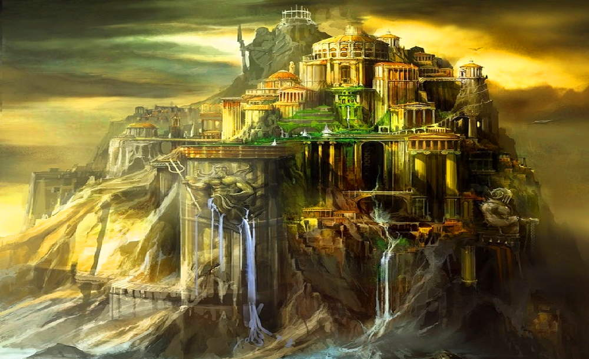

<!DOCTYPE html>
<html lang="en">
<head>
    <title>DAN'S WEBSITE</title>
</head>
<body bgcolor="yellow">

    <h1>HI EVERYONE!</h1>
 <h2>Nice to have you here!</h2>

    

 

<h2><i>This is my Greek mythology blog:</i></h2>

<h2><a href="https://www.mount-olympus-21.com/">My blog</a></h2>
<h3 align = "left">This is a passage from it</h3>

For the Greeks, Mount Olympus was the ultimate seat of power. The gods whose home it was controlled the earth and skies, and all that lived there. Theirs was an extended ruling family, often beset by arguments and egos, sometimes capricious, sometimes fiercely loyal, but always jealous of their own authority and merciless against any who opposed it.
    But the Olympians did not always rule the cosmos. Nor was there always a cosmos to rule. At first there was only Chaos, a yawning void, infinite and empty, a lifeless place of endless darkness. Hesiod described the process of creation:
    In the beginning came Chaos; next full-bosomed Gaia [Earth], an ever-safe foundation for all the deathless gods, who live on snowy Mount Olympus; and misty Tartarus in the bowels of the broad-pathed earth; and Eros [Desire], the most beautiful of all the deathless gods, who loosens limbs, seducing even the most clever minds and spirits of both gods and men.

 

    <h2>Send me an email at <a href="mailto:dan.nisnik27@mail.ru">dan.nisnik27@mail.ru</a></h2>

</a>

<b><h1>Thank you</h1></b>
    

</body>
</html>
